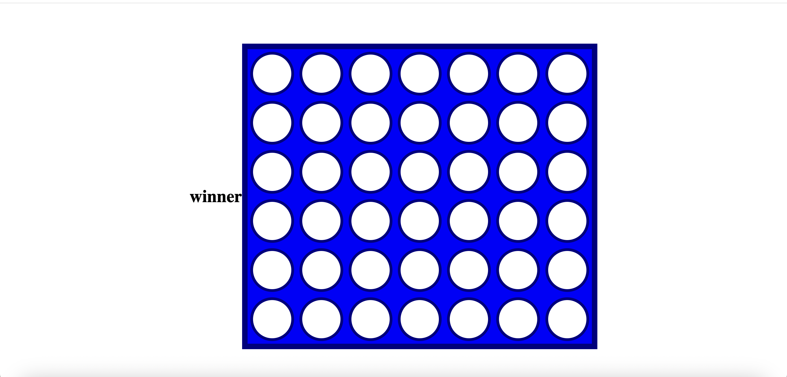

# CONNECT4

## Objectives

- Built a game with HTML, CSS and JavaScript developed using the DOM.
- A win state, loose state and draw.
- Multiple rounds of play.

## Technologies Used

- HTML
- CSS
- Javascript

## Features

- Connect4 is a 2 player game and is a classic game
- A win state - the player who first connect four of your coloured disks by dropping them into the holder before your opponent does.
- A Loose state
- Draw - If the board fills up before either player achieves four in a row, then the game is a draw.

## Output

